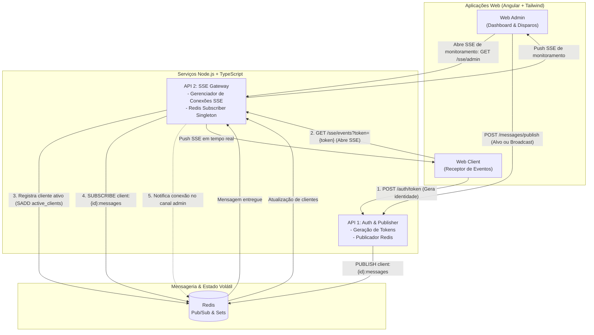

# Server-Sent Events (SSE) Distributed Architecture Showcase

Projeto monorepo demonstrando a implementação escalável e distribuída de **Server-Sent Events (SSE)** com **Node.js**, **TypeScript**, **Redis Pub/Sub**, **Angular** e **Tailwind CSS**, orquestrado inteiramente via **Docker Compose**.

---

## 📐 Arquitetura do Sistema



---

## 🎯 Decisões de Arquitetura & Design (ADRs)

### 1. Autenticação e Conexão SSE no Client
* **Decisão**: Utilização de **Query Parameter** (`/sse/events?token=<token>`).
* **Motivação**: Compatibilidade total com a API nativa do navegador (`new EventSource()`), sem a necessidade de wrappers ou bibliotecas de terceiros para manipulação de headers customizados.
* **Segurança**: O token recebido via query param é validado e decodificado no handshake da rota SSE antes de registrar os headers `text/event-stream`.

### 2. Descoberta e Monitoramento de Conexões pelo Admin
* **Decisão**: **Canal SSE Exclusivo de Administração** combinado com registro no **Redis (`Sets`)**.
* **Fluxo**:
  * Ao conectar/desconectar qualquer cliente na **API 2**, o estado é sincronizado no Redis (`SADD`/`SREM active_clients <clientId>`).
  * A **API 2** publica um evento de ciclo de vida (`client:connected` ou `client:disconnected`).
  * A aplicação **Web Admin** estabelece uma conexão SSE permanente com a **API 2** (`/sse/admin`) para receber essas notificações em tempo real, eliminando a necessidade de polling manual.

### 3. Gerenciamento de Conexões Redis (Subscriber Singleton)
* **Decisão**: No ecossistema Node.js, um cliente Redis em modo de subscrição (`SUBSCRIBE`) bloqueia a execução de comandos regulares.
* **Implementação**:
  * A **API 2** mantém conexões dedicadas: uma dedicada ao Pub/Sub (Subscriber) e outra para comandos padrão (armazenamento e consulta de chaves/sets).
  * Canais dinâmicos por cliente (`client:<clientId>:messages`) e canal global (`broadcast:messages`).
  * Ao detectar a desconexão do cliente (`req.on('close')`), a API 2 remove a subscrição do canal no Redis e desaloca a conexão da memória para prevenir *memory leaks*.

---

## 📂 Estrutura do Monorepo Proposta

```text
.
├── apps/
│   ├── api-auth/               # API 1: Auth, geração de token e publisher
│   │   ├── src/
│   │   ├── Dockerfile
│   │   └── package.json
│   ├── api-sse/                # API 2: Gateway SSE, gerenciador de conexões e subscriber
│   │   ├── src/
│   │   ├── Dockerfile
│   │   └── package.json
│   ├── web-admin/              # Angular Web: Painel administrativo e monitoramento
│   │   ├── src/
│   │   ├── Dockerfile
│   │   └── package.json
│   └── web-client/             # Angular Web: Cliente consumidor de eventos
│       ├── src/
│       ├── Dockerfile
│       └── package.json
├── packages/
│   └── shared-types/           # Contratos, interfaces e payloads compartilhados
│       ├── src/
│       └── package.json
├── docker-compose.yml          # Orquestração dos 5 serviços
├── package.json                # Workspaces de topo (NPM/PNPM Workspaces)
└── README.md
```

---

## 🛠️ Boas Práticas Adotadas em Cada Projeto

### Backend (APIs Node.js + TypeScript)
- **Separação em Camadas**: Clean Architecture / Ports & Adapters simplificado (Controllers, Services, Repositories/Adapters de Mensageria).
- **Gerenciamento Seguro de Conexões SSE**:
  - Configuração rigorosa de cabeçalhos (`Content-Type: text/event-stream`, `Cache-Control: no-cache`, `Connection: keep-alive`, `X-Accel-Buffering: no` para proxies Nginx).
  - Envio periódico de keep-alive (`:keepalive\n\n`) para evitar timeout de conexões inativas por roteadores/load balancers.
  - Limpeza imediata no evento `req.on('close')` para evitar vazamento de memória e conexões órfãs.
- **Resiliência e Graceful Shutdown**: Tratamento de sinais `SIGINT` e `SIGTERM` para fechar conexões ativas e desinscrever canais do Redis antes de encerrar os processos.
- **Tipagem Estrita e Validação de D schema**: TypeScript em modo estrito (`strict: true`) e validação de payloads via **Zod**.

### Frontend (Angular + Tailwind CSS)
- **Modern Angular**:
  - Uso exclusivo de **Standalone Components**.
  - Reatividade com **Signals** e **RxJS** integrados.
  - Estratégia de detecção de mudanças `ChangeDetectionStrategy.OnPush`.
- **Gerenciamento de EventSource**:
  - Encapsulamento em Services com teardown automático ao destruir componentes (`DestroyRef` / `takeUntilDestroyed`).
  - Reconexão inteligente com reconexão exponencial em caso de falha de rede.
- **Design System com Tailwind CSS**:
  - UI responsiva, consistente, com feedback visual de status de conexão (badge indicando conectado/desconectado).

### Infraestrutura & Docker
- **Multi-Stage Builds**: Redução do tamanho final das imagens Docker e aumento de segurança (apenas artefatos de produção nos contêineres).
- **Healthchecks**: Verificação de disponibilidade de serviços no Docker Compose (ex: Redis pronto antes de inicializar as APIs).
- **Isolamento de Redes**: Rede interna dedicada via Docker Network.

---

## 🚀 Os 5 Serviços do Docker Compose

| Serviço | Tipo | Porta Exposta | Descrição |
| :--- | :--- | :--- | :--- |
| **redis** | Broker | `6379:6379` | Broker Pub/Sub e controle de clientes ativos |
| **api-auth** | Node.js | `3001:3001` | Emissão de tokens e publicação de mensagens no Redis |
| **api-sse** | Node.js | `3002:3002` | Gateway SSE, subscriber de canais e emissor de streams |
| **web-admin** | Angular | `4200:80` | Painel de controle e monitoramento SSE |
| **web-client** | Angular | `4201:80` | Aplicação cliente consumidora dos eventos SSE |
